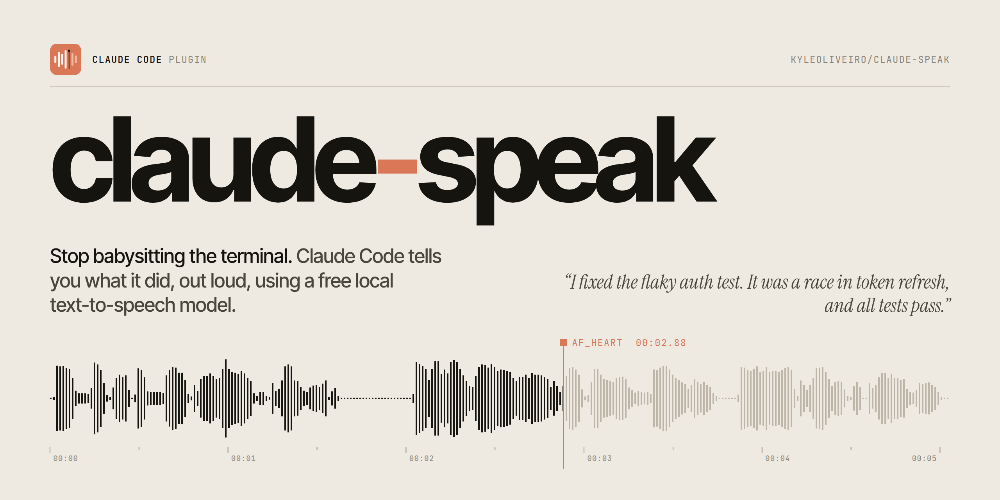

<p align="center">
  
</p>

<p align="center">
  <a href="LICENSE"></a>
  
  
  
</p>

<h1 align="center">claude-speak: text-to-speech for Claude Code</h1>

<p align="center">
  <b>Stop babysitting the terminal.</b> This Claude Code plugin tells you, out loud, what Claude just did.<br>
  It turns each reply into a one-line summary and speaks it with <a href="https://huggingface.co/hexgrad/Kokoro-82M">Kokoro</a>, a small, natural-sounding TTS model that runs locally and offline. No API key needed.
</p>

https://github.com/user-attachments/assets/ee47eeeb-565b-4383-93de-c6558dbcff10

<p align="center"><sub>🔊 Turn the sound on. Every voice in the video is claude-speak itself.</sub></p>

---

## Why

You hand Claude a task, switch to another window, and then keep checking back to see if it's done. With claude-speak you get a spoken voice notification instead:

> 🔊 *"I fixed the flaky auth test. It was a race in token refresh, and all tests pass."*

- **Free and local.** Speech is generated on your machine by an 82M-parameter model. No TTS API key, no per-character billing, and the audio never leaves your computer.
- **Summaries, not transcripts.** Long replies get condensed into one or two spoken sentences, in Claude's own voice ("I fixed…", "I need you to decide…"). Short replies are read as they are.
- **Fast.** The model stays loaded in a small background server, so speech starts about a second after the summary is ready. A few seconds of speech takes well under a second to generate on a laptop CPU.
- **Stays out of the way.** Switch voices or turn auto-speak off from a quick menu, and replay the last reply whenever you want. The voice server shuts itself down when you're not using it.

## Install the Claude Code plugin

**Requirements:** [Claude Code](https://code.claude.com), [`uv`](https://docs.astral.sh/uv/getting-started/installation/) and an audio player (`afplay` on macOS; `pw-play`, `paplay` or `aplay` on Linux, one of which is almost always installed).

In Claude Code:

```
/plugin marketplace add kyleoliveiro/claude-speak
/plugin install claude-speak@claude-speak
```

Or from your shell:

```bash
claude plugin marketplace add kyleoliveiro/claude-speak
claude plugin install claude-speak@claude-speak
```

That's it. The first time it speaks, claude-speak downloads the Kokoro model (about 335 MB) and its Python dependencies, which takes a minute. After that it's instant.

## Usage

With the default settings you don't have to do anything: every time Claude finishes a response, you hear a summary of it.

| Command | What it does |
| :-- | :-- |
| `/speak` | Speak a summary of Claude's last response |
| `/speak full` | Read the last response word for word (code blocks are skipped) |
| `/speak stop` | Stop talking |
| `/speak-settings` | Pick the voice, speed, auto-speak and summaries from a menu, then hear a sample of the new voice |
| `/speak-auto` | Turn automatic speaking on or off from a menu |
| `/speak-auto on` / `off` / `toggle` | The same, without the menu |

If another plugin uses the same command names, use the full names, e.g. `/claude-speak:speak-settings`.

## Settings

The quickest way to change settings is `/speak-settings`:

```
←  ☐ Voice  ☐ Speed  ☐ Auto-speak  ☐ Summaries  ✔ Submit  →

Which voice should read Claude's responses?
❯ 1. af_heart (current)    American English, female. Warm and natural.
  2. am_michael            American English, male. Calm and clear.
  3. bf_emma               British English, female. Crisp and bright.
  4. bm_george             British English, male. Low and measured.
  5. Type something.       Any other Kokoro voice, e.g. am_fenrir
```

The same settings, plus the summary model, are also under the **claude-speak** rows in `/config`:

| Setting | Default | |
| :-- | :-- | :-- |
| Speak every response | `on` | Speak each response automatically. Turn off to speak only when you run `/speak`. |
| Summarize before speaking | `on` | Speak a short summary instead of the whole response. Responses under ~280 characters are always read in full. |
| Voice | `af_heart` | Any Kokoro voice (see below). |
| Speaking speed | `1.1` | From `0.5` to `2.0`. |
| Summary model | `haiku` | The Claude model that writes the spoken summary. |

Choices made with `/speak-settings` or `/speak-auto` apply right away, in every session, and take priority over `/config`. Run `/speak-settings reset` to go back to your `/config` values. Changes made in `/config` apply from the next response.

### Voices

Kokoro has 54 voices. The first letter is the accent and the second is the voice's gender (`f` female, `m` male). A few good ones to try:

| American English | British English |
| :-- | :-- |
| `af_heart` ⭐ `af_bella` `af_nicole` `af_sarah` `af_sky` `am_michael` `am_fenrir` `am_puck` `am_adam` | `bf_emma` `bf_isabella` `bf_alice` `bm_george` `bm_fable` `bm_lewis` `bm_daniel` |

There are also Spanish (`e…`), French (`ff_siwis`), Hindi (`h…`), Italian (`i…`), Japanese (`j…`), Brazilian Portuguese (`p…`) and Mandarin (`z…`) voices. See the [full list and quality grades](https://huggingface.co/hexgrad/Kokoro-82M/blob/main/VOICES.md).

## How it works

```
 Claude finishes a reply
          │
          ▼
 Stop hook ──▶ reads the reply from the session transcript
          │
          ▼
 claude -p --model haiku ──▶ "I fixed the flaky auth test…"      (skipped for short replies)
          │
          ▼
 claude-speak server (Kokoro, kept warm) ──▶ your speakers
```

- A **Stop hook** runs when Claude finishes a response. It returns in about 50 ms and does the rest in a detached background process, so it never slows Claude down.
- The **summary** is written by a one-off `claude -p` call using your existing Claude Code login, with no tools, MCP servers or extended thinking, so it takes about 3 seconds.
- The **voice server** is a small Python process (managed by `uv`) that keeps Kokoro loaded and listens on a local Unix socket. It starts on first use, speaks long text sentence by sentence so audio begins right away, interrupts itself when something new arrives, and exits after 30 idle minutes.

### Privacy

Speech synthesis is 100% local. The only network call is the summary, which goes to Claude through your own Claude Code account, the same place the response came from. Turn **Summarize before speaking** off and claude-speak makes no network calls at all (after the one-time model download).

## Troubleshooting

**No sound.** Run the plugin's CLI directly to see what's happening:

```bash
~/.claude/plugins/cache/claude-speak/claude-speak/*/bin/claude-speak status
~/.claude/plugins/cache/claude-speak/claude-speak/*/bin/claude-speak say "testing one two three"
```

The server log is in `~/.claude/plugins/data/claude-speak-claude-speak/server.log`, and errors from background runs go to `claude-speak.log` in the same folder. If `status` says `player: none`, install an audio player (`sudo apt install pipewire-bin` or `alsa-utils`), or set `CLAUDE_SPEAK_PLAYER` to any command that plays a WAV file.

**The first response was silent.** That was probably the one-time model download. Check `server.log`; it should say `listening on …` once it's done.

**It talks too much.** Run `/speak-auto` and choose Off, then use `/speak` when you want to hear something. Or raise the speed in `/speak-settings`.

### Advanced

These environment variables go in your shell profile, or under `env` in `~/.claude/settings.json`:

| Variable | Default | |
| :-- | :-- | :-- |
| `CLAUDE_SPEAK_MODEL` | `fp32` | `fp16` (~170 MB) or `int8` (~90 MB) for a smaller download and less memory. `fp32` sounds best. |
| `CLAUDE_SPEAK_IDLE_TIMEOUT` | `1800` | Seconds before the idle voice server exits. |
| `CLAUDE_SPEAK_PLAYER` | auto | Audio player command, e.g. `mpv --really-quiet`. |
| `CLAUDE_SPEAK_LEAD_IN` | `2.0` | Seconds a sleeping output device (e.g. Bluetooth) gets to wake up before speech starts. claude-speak wakes it while the summary is written, so this usually adds no delay. Raise it if the start is still cut off, or lower it for wired speakers. |

The voice server uses about 800 MB of RAM with the default model while it's running.

## Uninstall

```
/plugin uninstall claude-speak@claude-speak
```

This also deletes the downloaded model.

## Contributing

Issues and pull requests are welcome. To hack on it locally:

```bash
git clone https://github.com/kyleoliveiro/claude-speak && cd claude-speak
claude --plugin-dir .                 # run Claude Code with your working copy
claude plugin validate .              # check the manifests
CLAUDE_SPEAK_DATA=/tmp/claude-speak ./bin/claude-speak say "hello"   # test the voice directly
```

The client (`scripts/claude_speak.py`) is stdlib-only Python. The voice server (`scripts/server.py`) declares its dependencies inline and runs with `uv run --script`. The banner is `assets/banner.html`, generated by `assets/make_banner.py` from a real Kokoro recording, so the waveform is the actual voice. The promo video is rendered the same way by `assets/video/make_video.py`.

## Credits

- [Kokoro-82M](https://huggingface.co/hexgrad/Kokoro-82M) by hexgrad, Apache 2.0
- [kokoro-onnx](https://github.com/thewh1teagle/kokoro-onnx) by thewh1teagle, MIT

## License

[MIT](LICENSE)
